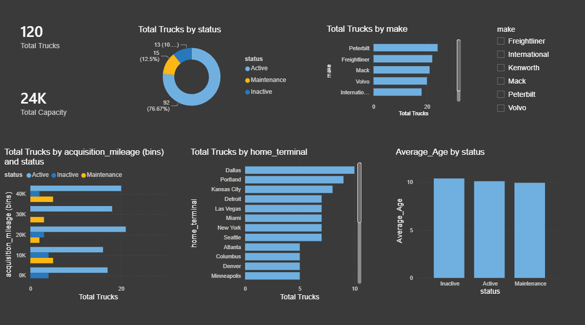

# Fleet Logistics & Operations Dashboard (Power BI)

## 📊 Project Overview
Developed an interactive operations dashboard analyzing a fleet of 120 commercial trucks to track vehicle status, age distribution, and home terminal locations. Engineered key metrics to monitor a 24K-gallon total fuel tank capacity and grouped vehicle acquisition mileage into dynamic bins using custom calculations to optimize maintenance schedules.

## 🚀 Live Dashboard Preview
*If you are browsing from a mobile device, you can view the full interface layout below:*

## 🛠️ Tech Stack & Skills Applied
* **Tool:** Power BI Desktop
* **Calculations & Data Modeling:** DAX (Calculated columns for acquisition mileage binning, fleet totals, and cumulative fuel capacities)
* **Visualizations:** Donut charts for fleet status, Horizontal Bar charts for manufacturer (make) and home terminals distribution, and KPI cards.

## 📁 Repository Structure
* `*.pbix`: The core Power BI dashboard file and data model.
